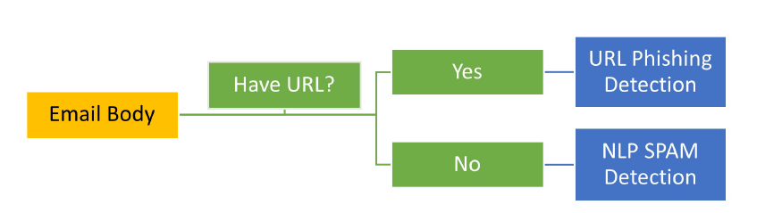
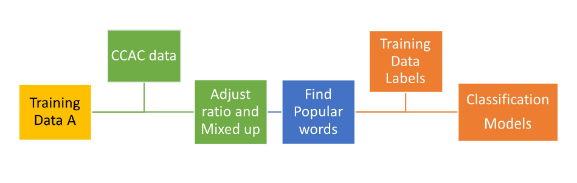
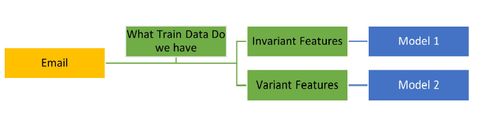

# NLP_Phishing_Mail_Detection

### Title
2022 Crossroads Classic Analytics Challenge Competition: NLP Phishing Email Detection

### url
https://crossroadsclassicanalyticschallenge.com/

### Competition
The Crossroads Classic Analytics Challenge was established in 2021 by faculty at universities in Indiana that love their school, students, and the great State of Indiana. 

The teams were from Indiana University, Purdue University, Butler University and Notre Dame University. 

There are total 29 teams had submitted their work. Our team members were Shiue-Yuan Chuang and Andrew Huang, and we got the top four placements among the teams in Indiana University and advanced to the semi-final round.

### Problem Statement
Phishing is the most popular form of social engineering and can be leveraged to put malware or ransomware into a company’s environment. MISO performs routine phishing tests to make sure their employees are ready and prepared. ECS helps protect companies from cyber threats every day, and IN3 helps bring people together to create a hub of national security innovation to help solve critical defense priorities. How can data science and predictive analytics help employees gain confidence in receiving emails that they are real? (https://crossroadsclassicanalyticschallenge.com/)

### Work Description
The work was collaborated by Andrew Huang and Shiue-Yuan Chuang in Febuary 2022.
#### Not a traditional Supervised Learning Problem
In the competition, we were given a data set of email (email address, subject, content), but was NOT told whether these emails are phishing cases or not.
Therefore, we have to do research and label the email by ourselves. For example, an email with weird sender address may be a spam case; an email comtains strange links may be a phishing case. 
We designed two classified models: 
* Phishing Model: 
  * If the email includes URL in content, we applied rule-based model to determined if the url is a phishing link (that is, it is a phishing email).
  * Phishing Websites Features: We used the features suggested by Mohammad et al. (2015)
* SPAM Model: 
  * For emails contain NO URLs, we use NLP model to determine if it is a SPAM case. 
  * Classifiers: Check that the train and test data have similar distribution after tokenization. Got voting results from RNN, LSTM, GRU models.

### Results
We have 0.64 in final accuracy.

To be more general, in our approach, we find variant (SPAM words) and invariant (phishing website features) features, and refer them to different models.
With the accuracy, we got the top four placements among the teams in Indiana University and advanced to the semi-final round.

